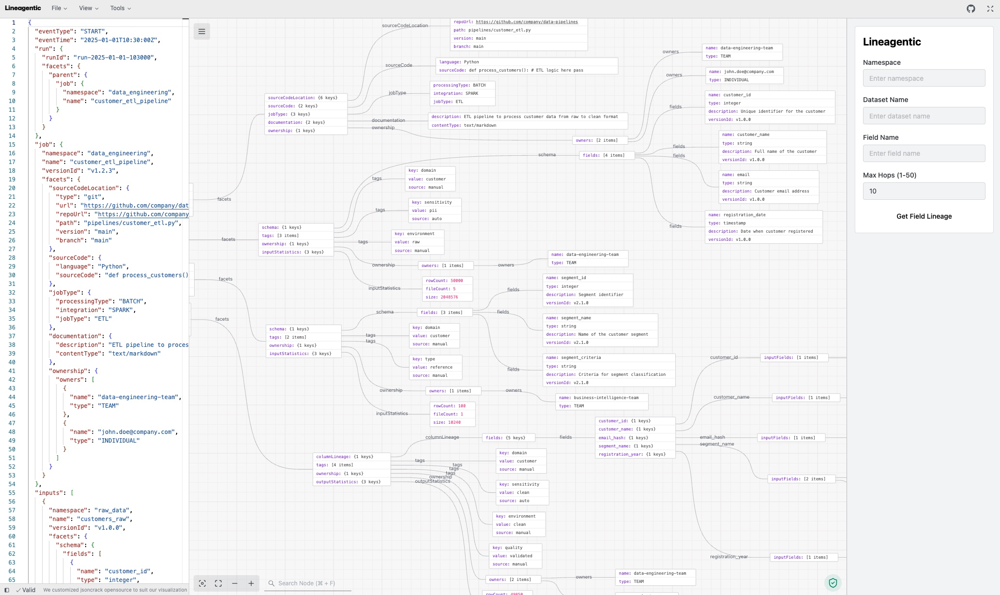

<div align="center">
  
</div>

## About
This project is a tool for visualizing data lineage in a structured, interactive graphs, making it easier to also query the data from the graph.

## Architecture



## Development

### Setup

### Makefile Commands

This project includes a Makefile with convenient commands for development and deployment:

#### Start the Lineage Visualizer
```bash
make start-lineage-visualizer
```
- Installs dependencies with `pnpm install`
- Starts the development server in the background
- Waits until the service is fully available on `http://localhost:3000`
- Shows status messages throughout the startup process

#### Stop the Lineage Visualizer
```bash
make stop-lineage-visualizer
```
- Stops the running lineage visualizer process
- Kills any `pnpm run dev` processes

#### Clean All Stack
```bash
make clean-all-stack
```
- Kills processes running on port 3000
- Removes temporary files (`.log`, `temp_*.json`, `generated-*.json`)
- Cleans up build artifacts (`node_modules`, `.pnpm-store`, `.next`)
- Useful for a complete reset of the development environment

## Configuration

The supported node limit can be changed by editing the `NEXT_PUBLIC_NODE_LIMIT` value in the `.env` file at the project root.

<!-- LICENSE -->

## License

See [`LICENSE`](/LICENSE.md) for more information.
